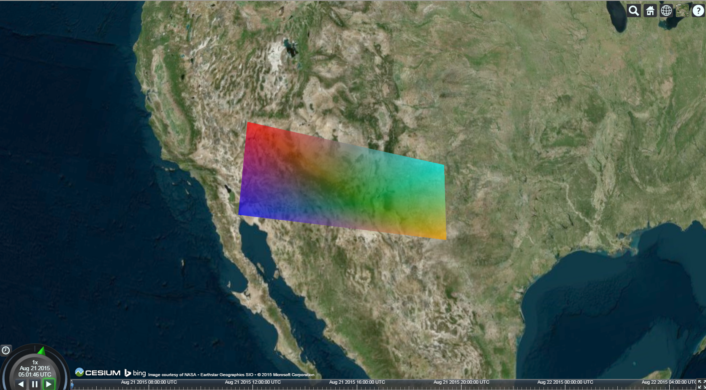

#Cesium-plugins library#

###A library of plugins for the WebGl map engine <a href="https://github.com/AnalyticalGraphicsInc/cesium" target="_blank">Cesium</a>.###

**Cesium version:** 1.12 (released 2015-08-03)

**Description:** I started working with Cesium in <a href="https://www.purdue.edu/discoverypark/vaccine/" target="_blank">my lab at Purdue</a> as the demand for web applications grew from various projects. Our lab is heavily dependent on spatial visualization and had used OpenGL to do this for many years. We needed a library that took care of the map tile rendering, allowed draw using the WebGL graphics, also give us the flexibility to define our own shaders. I had to either find this library or I would have to do everything from scratch. Enter Cesium. However, I needed a few things the library didn't offer, like drawing multi-color polygons. There are more things I intend to add as we need them in the lab.

**Comments:** It's worth noting that I threw this plug-in together in my off time so the code may not be perfect and there are probably much better ways to do what I'm doing. If you know such ways of doing things better, I would love to know them too. Please email me at [olsenb@purdue.edu](olsenb@purdue.edu).

**Credit:** 

- Thanks to the <a href="http://www.slmpd.org/Crimereports.shtml" target="_blank">St. Louis Police Department</a> for their data.
- Thanks to <a href="http://colorbrewer2.org/" target="_blank">ColorBrewer</a> for the awesome color schemes in JSON.
- Of course thanks to the <a href="http://cesiumjs.org/" target="_blank">Cesium</a> team for their awesome library.

See the [License](LICENSE.md).

##Plug-ins:##

1. MultiColorTriangle - I needed to have the flexibility to specify multi-color polygons and the traditional way for us to do this was to break any rendering task down into small multi-color triangles. Cesium already had all the tools needed to do this it just needed to be written. I don't claim that this is the best way. I've added two examples to show MultiColorTriangle:
	- <a href="http://web.ics.purdue.edu/~olsenb/cesium/simple.html" target="_blank">Simple.html</a> is a set of 4 triangles created from five verteces to display the nice blending capabilities of WebGL. Kind of the typical "[Hello Triangle examples](http://www.learnopengl.com/#!Getting-Started/Hello-Triangle)" you learn in any GL library. 
		
	- <a href="http://web.ics.purdue.edu/~olsenb/cesium/stlcrime.html" target="_blank">stlcrime.html</a> is a slightly more complex example that demonstrates a big reason why you would want to have this plug-in. This in particular is just a count (Heat Map) of the public reported crimes in St. Louis during the month of July 2015. This plug-in can visualize outside of the typical heatmap scenario; I just can't think of anything else to do that was quick and dirty. 
		

		- Also, if you're from St. Louis I wan't to note that this is a very biased visualization. I don't take a lot into account and have performed no preprocessing on the raw data. I simply put a +1 where I find a record with spatial information but some records are actually adjustments, meaning they are actually decrementing the count so agian very biased for the time being.

##Extras:##
Some things I don't really consider plug-ins but just extras. These I added to the Core folder.

1. **ColorScheme.js** - A module that helps define "bins" for a color scheme and can identify which color to assign that corresponds to a certain value. It can also automatically generate a legend.

##Bugs:##
1. I am having trouble getting createMultiColorPolygon to work. So currently it's being done synchronously calling createGeometry.

##Future Plans:##
1. Add in the pack/unpack functions to my geometry class. (This may also be causing some issues with using a web worker)

1. Allow extruded multi-color triangle (1 color per (lat/long))

1. Build off item 2 and do what's being done in ground polygon branch but with multi color triangles so we can render multi-color polygons on a terrain.

1. See about extending functionality to Entity API.

1. I've considered adding a Graph API to specify 3D shapes in space but this my be too complex for a browser.

